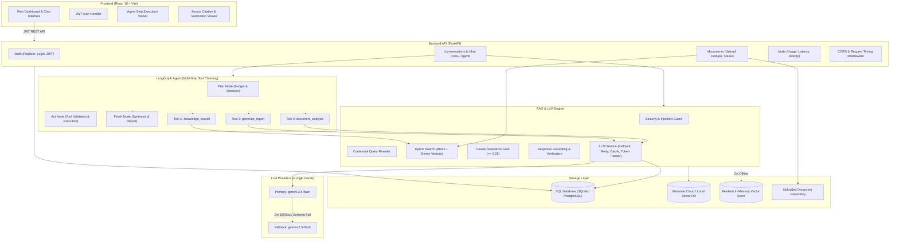
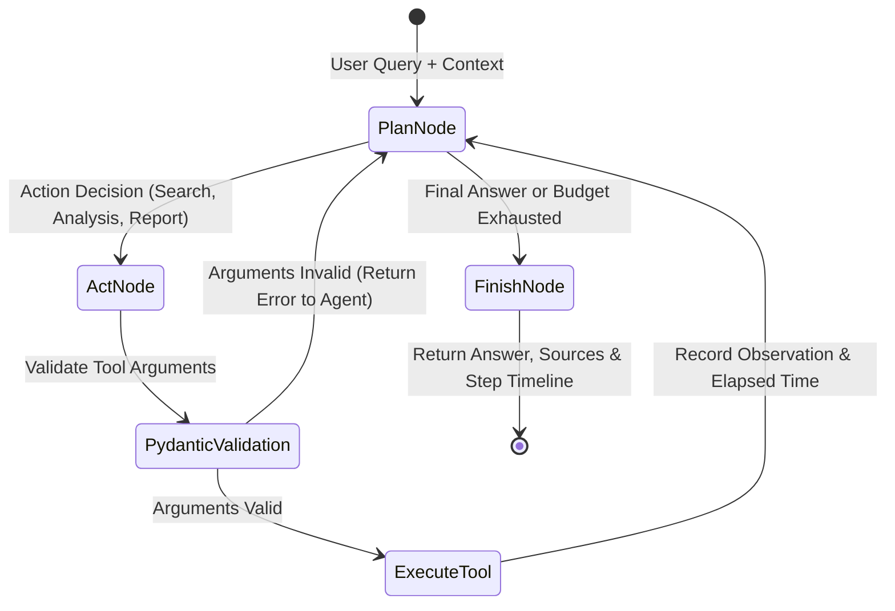
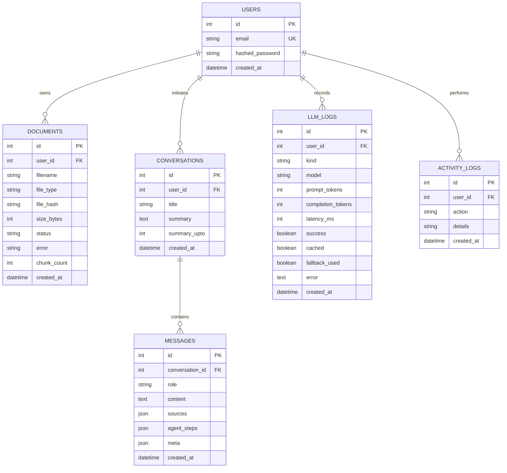

# System Architecture & Component Interactions

## 1. High-Level System Architecture

```mermaid
flowchart TD
    subgraph Client["Frontend (React 18 + Vite)"]
        UI["Web Dashboard & Chat Interface"]
        AUTH_UI["JWT Auth Handler"]
        AGENT_TIMELINE["Agent Step Execution Viewer"]
        SRC_VIEWER["Source Citation & Verification Viewer"]
    end

    subgraph API_GATEWAY["Backend API (FastAPI)"]
        ROUTER_AUTH["/auth (Register, Login, JWT)"]
        ROUTER_DOCS["/documents (Upload, Dedupe, Status)"]
        ROUTER_CHAT["/conversations & /chat (RAG / Agent)"]
        ROUTER_STATS["/stats (Usage, Latency, Activity)"]
        MIDDLEWARE["CORS & Request Timing Middleware"]
    end

    subgraph RAG_PIPELINE["RAG & LLM Engine"]
        SEC["Security & Injection Guard"]
        REWRITE["Contextual Query Rewriter"]
        HYBRID_RET["Hybrid Search (BM25 + Dense Vectors)"]
        GATE["Cosine Relevance Gate (>= 0.25)"]
        VERIFY["Response Grounding & Verification"]
        LLM_WRAPPER["LLM Service (Fallback, Retry, Cache, Token Tracker)"]
    end

    subgraph AGENT_SYSTEM["LangGraph Agent (Multi-Step Tool Chaining)"]
        PLAN["Plan Node (Budget & Decision)"]
        ACT["Act Node (Tool Validation & Execution)"]
        FINISH["Finish Node (Synthesis & Report)"]
        T_SEARCH["Tool 1: knowledge_search"]
        T_ANALYZE["Tool 2: document_analysis"]
        T_REPORT["Tool 3: generate_report"]
    end

    subgraph STORAGE["Storage Layer"]
        SQL_DB[("SQL Database (SQLite / PostgreSQL)")]
        WEAVIATE[("Weaviate Cloud / Local Vector DB")]
        LOCAL_FALLBACK[("Resilient In-Memory Vector Store")]
        FILESYSTEM["Uploaded Document Repository"]
    end

    subgraph EXTERNAL_LLM["LLM Providers (Google GenAI)"]
        GEMINI_PRIMARY["Primary: gemini-3.5-flash"]
        GEMINI_FALLBACK["Fallback: gemini-2.5-flash"]
    end

    UI -->|JWT REST API| API_GATEWAY
    API_GATEWAY --> SQL_DB
    ROUTER_DOCS --> FILESYSTEM
    ROUTER_DOCS --> HYBRID_RET
    ROUTER_CHAT --> RAG_PIPELINE
    ROUTER_CHAT --> AGENT_SYSTEM

    RAG_PIPELINE --> WEAVIATE
    RAG_PIPELINE -.->|On Offline| LOCAL_FALLBACK
    RAG_PIPELINE --> LLM_WRAPPER

    AGENT_SYSTEM --> T_SEARCH --> HYBRID_RET
    AGENT_SYSTEM --> T_ANALYZE --> LLM_WRAPPER
    AGENT_SYSTEM --> T_REPORT --> LLM_WRAPPER
    AGENT_SYSTEM --> FINISH

    LLM_WRAPPER --> GEMINI_PRIMARY
    GEMINI_PRIMARY -.->|On 429/5xx / Schema Fail| GEMINI_FALLBACK
    LLM_WRAPPER --> SQL_DB
```

---

## 2. Multi-Step LangGraph Agent Workflow

```mermaid
stateDiagram-v2
    [*] --> PlanNode: User Query + Context
    PlanNode --> ActNode: Action Decision (Search, Analysis, Report)
    PlanNode --> FinishNode: Final Answer or Budget Exhausted
    ActNode --> PydanticValidation: Validate Tool Arguments
    PydanticValidation --> ExecuteTool: Arguments Valid
    PydanticValidation --> PlanNode: Arguments Invalid (Return Error to Agent)
    ExecuteTool --> PlanNode: Record Observation & Elapsed Time
    FinishNode --> [*]: Return Answer, Sources & Step Timeline
```

---

## 3. Database Schema (Entity-Relationship)

```mermaid
erDiagram
    USERS ||--o{ DOCUMENTS : owns
    USERS ||--o{ CONVERSATIONS : initiates
    USERS ||--o{ LLM_LOGS : records
    USERS ||--o{ ACTIVITY_LOGS : performs
    CONVERSATIONS ||--o{ MESSAGES : contains

    USERS {
        int id PK
        string email UK
        string hashed_password
        datetime created_at
    }

    DOCUMENTS {
        int id PK
        int user_id FK
        string filename
        string file_type
        string file_hash
        int size_bytes
        string status
        string error
        int chunk_count
        datetime created_at
    }

    CONVERSATIONS {
        int id PK
        int user_id FK
        string title
        text summary
        int summary_upto
        datetime created_at
    }

    MESSAGES {
        int id PK
        int conversation_id FK
        string role
        text content
        json sources
        json agent_steps
        json meta
        datetime created_at
    }

    LLM_LOGS {
        int id PK
        int user_id FK
        string kind
        string model
        int prompt_tokens
        int completion_tokens
        int latency_ms
        boolean success
        boolean cached
        boolean fallback_used
        text error
        datetime created_at
    }

    ACTIVITY_LOGS {
        int id PK
        int user_id FK
        string action
        string details
        datetime created_at
    }
```

